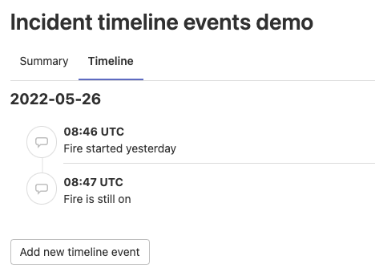

# Timeline events

> [Introduced](https://gitlab.com/gitlab-org/gitlab/-/issues/344059) in GitLab 15.2 [with a flag](../../administration/feature_flags.md) named `incident_timeline`. Enabled by default.

FLAG:
On self-managed GitLab, by default this feature is available. To hide the feature, ask an administrator to [disable the feature flag](../../administration/feature_flags.md) named `incident_timeline`.
On GitLab.com, this feature is available.

Incident timelines are an important part of record keeping for incidents.
Timelines can show executives and external viewers what happened during an incident,
and which steps were taken for it to be resolved.

## View the timeline

Incident timeline events are listed in ascending order of the date and time.
They are grouped with dates and are listed in ascending order of the time when they occurred:

To view the event timeline of an incident:

1. On the top bar, select **Menu > Projects** and find your project.
1. On the left sidebar, select **Monitor > Incidents**.
1. Select an incident.
1. Select the **Timeline** tab.

## Create an event

You can create a timeline event in many ways in GitLab.

### Using the form

Create a timeline event manually using the form.

Prerequisites:

- You must have at least the Developer role for the project.

To create a timeline event:

1. On the top bar, select **Menu > Projects** and find your project.
1. On the left sidebar, select **Monitor > Incidents**.
1. Select an incident.
1. Select the **Timeline** tab.
1. Select **Add new timeline event**.
1. Complete the required fields.
1. Select **Save** or **Save and add another event**.

### Using a quick action

> [Introduced](https://gitlab.com/gitlab-org/gitlab/-/issues/368721) in GitLab 15.4.

You can create a timeline event using the `/timeline` [quick action](../../user/project/quick_actions.md).

### From a comment on the incident

> [Introduced](https://gitlab.com/gitlab-org/gitlab/-/issues/344058) in GitLab 15.4.

Prerequisites:

- You must have at least the Developer role for the project.

To create a timeline event from a comment on the incident:

1. On the top bar, select **Menu > Projects** and find your project.
1. On the left sidebar, select **Monitor > Incidents**.
1. Select an incident.
1. Create a comment or choose an existing comment.
1. On the comment you want to add, select **Add comment to incident timeline** (**{clock}**).

The comment is shown on the incident timeline as a timeline event.

## Delete an event

You can also delete timeline events.

Prerequisites:

- You must have at least the Developer role for the project.

To delete a timeline event:

1. On the top bar, select **Menu > Projects** and find your project.
1. On the left sidebar, select **Monitor > Incidents**.
1. Select an incident.
1. Select the **Timeline** tab.
1. On the right of a timeline event, select **More actions** (**{ellipsis_v}**) and then select **Delete**.
1. To confirm, select **Delete Event**.
