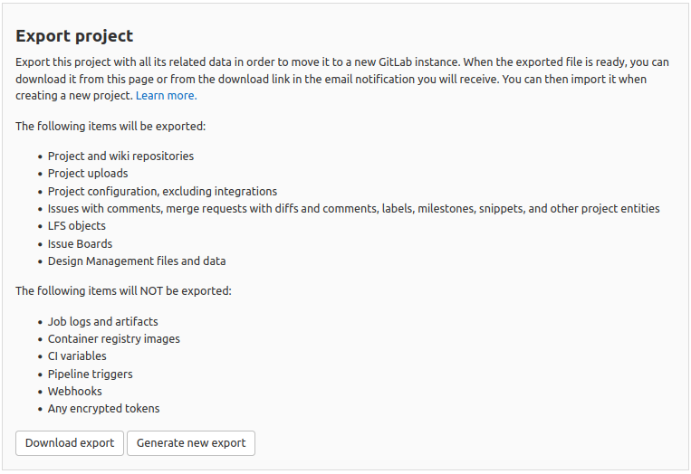

# Project import/export

> - [Introduced](https://gitlab.com/gitlab-org/gitlab-foss/issues/3050) in GitLab 8.9.
> - From GitLab 10.0, administrators can disable the project export option on the GitLab instance.

Existing projects running on any GitLab instance or GitLab.com can be exported with all their related
data and be moved into a new GitLab instance.

The **GitLab import/export** button is displayed if the project import option is enabled.

See also:

- [Project import/export API](../../../api/project_import_export.md)
- [Project import/export administration rake tasks](../../../administration/raketasks/project_import_export.md) **(CORE ONLY)**
- [Group import/export API](../../../api/group_import_export.md)

To set up a project import/export:

  1. Navigate to **{admin}** **Admin Area >** **{settings}** **Settings > Visibility and access controls**.
  1. Scroll to **Import sources**
  1. Enable desired **Import sources**

## Important notes

Note the following:

- Imports will fail unless the import and export GitLab instances are
  compatible as described in the [Version history](#version-history).
- Exports are stored in a temporary [shared directory](../../../development/shared_files.md)
  and are deleted every 24 hours by a specific worker.
- Group members are exported as project members, as long as the user has
  maintainer or admin access to the group where the exported project lives. Import admins should map users by email address.
  Otherwise, a supplementary comment is left to mention that the original author and
  the MRs, notes, or issues will be owned by the importer.
- Project members with owner access will be imported as maintainers.
- If an imported project contains merge requests originating from forks,
  then new branches associated with such merge requests will be created
  within a project during the import/export. Thus, the number of branches
  in the exported project could be bigger than in the original project.

## Version history

The following table lists updates to Import/Export:

| Exporting GitLab version   | Importing GitLab version   |
| -------------------------- | -------------------------- |
| 11.7 to current            | 11.7 to current            |
| 11.1 to 11.6               | 11.1 to 11.6               |
| 10.8 to 11.0               | 10.8 to 11.0               |
| 10.4 to 10.7               | 10.4 to 10.7               |
| 10.3                       | 10.3                       |
| 10.0 to 10.2               | 10.0 to 10.2               |
| 9.4 to 9.6                 | 9.4 to 9.6                 |
| 9.2 to 9.3                 | 9.2 to 9.3                 |
| 8.17 to 9.1                | 8.17 to 9.1                |
| 8.13 to 8.16               | 8.13 to 8.16               |
| 8.12                       | 8.12                       |
| 8.10.3 to 8.11             | 8.10.3 to 8.11             |
| 8.10.0 to 8.10.2           | 8.10.0 to 8.10.2           |
| 8.9.5 to 8.9.11            | 8.9.5 to 8.9.11            |
| 8.9.0 to 8.9.4             | 8.9.0 to 8.9.4             |

Projects can be exported and imported only between versions of GitLab with matching Import/Export versions.

For example, 8.10.3 and 8.11 have the same Import/Export version (0.1.3)
and the exports between them will be compatible.

## Exported contents

The following items will be exported:

- Project and wiki repositories
- Project uploads
- Project configuration, including services
- Issues with comments, merge requests with diffs and comments, labels, milestones, snippets,
  and other project entities
- Design Management files and data **(PREMIUM)**
- LFS objects
- Issue boards
- Pipelines history

The following items will NOT be exported:

- Build traces and artifacts
- Container registry images
- CI variables
- Webhooks
- Any encrypted tokens
- Merge Request Approvers
- Push Rules
- Awards

NOTE: **Note:**
For more details on the specific data persisted in a project export, see the
[`import_export.yml`](https://gitlab.com/gitlab-org/gitlab/blob/master/lib/gitlab/import_export/project/import_export.yml) file.

## Exporting a project and its data

1. Go to your project's homepage.

1. Click **{settings}** **Settings** in the sidebar.

1. Scroll down to find the **Export project** button:

   

1. Once the export is generated, you should receive an e-mail with a link to
   download the file:

   

1. Alternatively, you can come back to the project settings and download the
   file from there, or generate a new export. Once the file is available, the page
   should show the **Download export** button:

   

## Importing the project

1. The GitLab project import feature is the first import option when creating a
   new project. Click on **GitLab export**:

   

1. Enter your project name and URL. Then select the file you exported previously:

   

1. Click on **Import project** to begin importing. Your newly imported project
   page will appear soon.

NOTE: **Note:**
If use of the `Internal` visibility level
[is restricted](../../../public_access/public_access.md#restricting-the-use-of-public-or-internal-projects),
all imported projects are given the visibility of `Private`.

## Rate limits

To help avoid abuse, users are rate limited to:

| Request Type     | Limit                       |
| ---------------- | --------------------------- |
| Export           | 1 project per 5 minutes     |
| Download export  | 10 projects per 10 minutes  |
| Import           | 30 projects per 5 minutes  |
